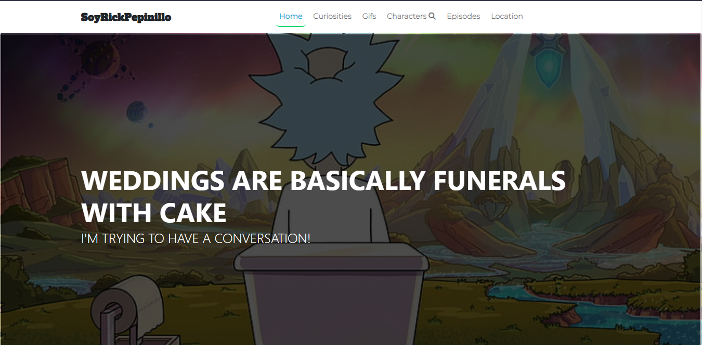
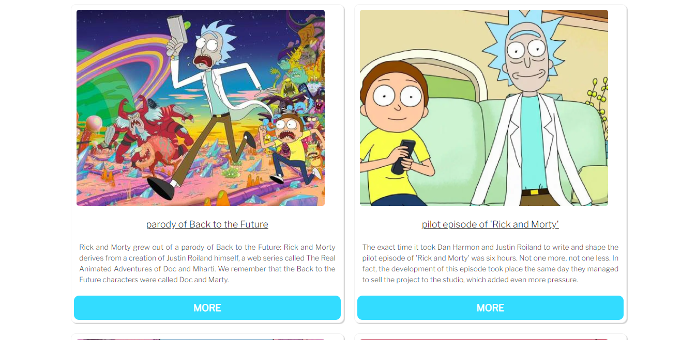
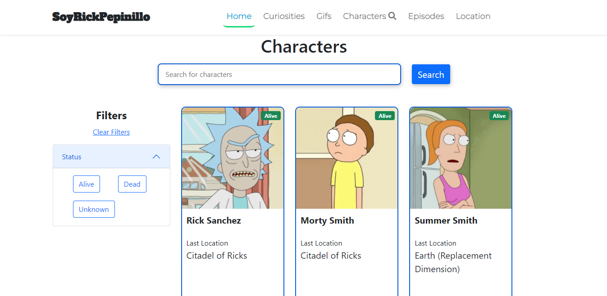

# Actividad API RICK & MORTY (_Donde están mis testículos summer?_)

_Aplicación Frontend (Vite, React-router-dom, redux, sass, css, bootstrap,react-icons, font-awesome)._

## Ejecución del proyecto ⌨️
_`Vite: localhost:3000`_

## Pagina

## Autora ✒️
* **Lina María Guerrero** - *Donde están mis testículos summer?* - [LMFront-end](https://github.com/LMFront-end)

### Sofka-U 2022

